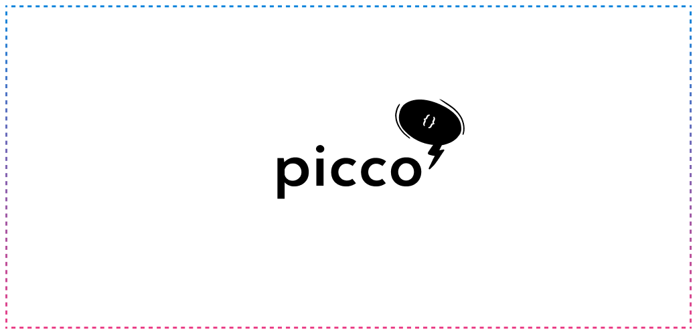

<p>
  
</p>

[](https://bundlephobia.com/result?p=picco)
[](https://www.npmjs.com/package/picco)

---

Picco is a tiny state management library for react. It is heavily inspired by [zustand](https://github.com/pmndrs/zustand).

Picco's API is intentionally kept minimal and as close to the native `useState` react hook as possible. Think of it as `useState` with goodies.

---

## installation

```bash
npm install picco --save # or yarn add picco
```

## usage

```jsx
import { create } from "picco";

const useCounterStore = create(0);

function Counter() {
  const [count, setCount] = useCounterStore();

  return (
    <div>
      <h1>{count}</h1>
      <button onClick={() => setCount(count + 1)}>Increment</button>
    </div>
  );
}
```

Or you can use `create` to create actions to modify the state.

```jsx
const useCounterStore = create(0, (set) => ({
  increment: () => set((count) => count + 1),
  decrement: () => set((count) => count - 1),
}));
```

All the actions become available to the setState function.

```jsx
function Counter() {
  const [count, setCount] = useCounterStore();

  return (
    <div>
      <h1>{count}</h1>
      <button onClick={setCount.increment}>Increment</button>
      <button onClick={setCount.decrement}>Decrement</button>
    </div>
  );
}
```

The hook also has a `getState`, `setState` and `subscribe` function. Use them to get the current state, set the state and subscribe to state changes outside the react components.

```jsx
const useCounterStore = create(0);

// subscribe to state changes
useCounterStore.subscribe((count) => console.log(count));

// or get the current state
const count = useCounterStore.getState();
```

It's render optimized. It only re-renders the components when the part of the state they are subscribed to changes.

```jsx
const useCoordinates = create({ x: 0, y: 0 }, (set) => ({
  setX: (x) => set({ x }),
  setY: (y) => set({ y }),
}));

function X() {
  const [x, setState] = useCoordinates((state) => state.x);

  return (
    <div>
      <h1>{x}</h1>
      <button onClick={() => setState.setX(x + 1)}>Increment</button>
    </div>
  );
}
```

The above component will only re-render when the `x` value changes.

## license

MIT License © Yatharth K
